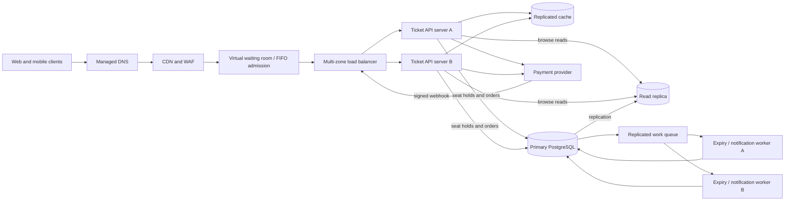

# TicketHub: Event Ticketing System Design

## 1. Requirements

### Functional requirements

- Visitors can browse events, see event details, prices, and a current seat map.
- Registered users can enter a fair sale waiting room, hold available seats, pay for an order, and view their tickets.
- A hold has a short expiration (five minutes). An unpaid or abandoned hold is released automatically; a payment already in progress gets a bounded extension.
- Users can buy multiple seats in one order, but the system never confirms the same seat in two paid orders.
- APIs are authenticated where needed, idempotent for retried hold and payment requests, and return clear sold-out, expired-hold, and payment errors.
- Sale rules (such as per-user ticket limits) are enforced on the server, not trusted to the browser.

### Non-functional requirements

- **Speed:** event pages and seat-map reads should meet a p95 latency target of 300 ms under normal load; hold requests should meet 500 ms p95 before external payment work.
- **Correctness:** the database is authoritative for inventory. Seat claims and order creation are atomic, payment callbacks are idempotent, and stale cache data can never confirm a seat.
- **Fairness:** a virtual waiting room assigns signed admission tokens in server-observed arrival order and admits buyers at a controlled rate. Tokens are short-lived and bound to a user/session; direct API calls without a valid token cannot skip the queue. One token has the same purchase limit and hold duration as another.
- **Availability:** browsing can degrade gracefully during a sale, but the service fails closed for uncertain seat claims rather than risk double-selling. Target 99.9% monthly availability outside announced sale events.
- **Security:** TLS, least-privilege service access, payment-provider tokenization, bot/rate-limit controls, and audit logs protect accounts and checkout.
- **Scalability:** stateless app servers scale horizontally; the sale gate protects transactional inventory from the much larger read and arrival burst.

## 2. Traffic estimates

Use 86,400 seconds per day. Treat one page view as one application read request. The normal-day facts do not specify bursts, so averages below are baseline capacity figures, not the normal peak. For the sale estimate, assume each of the 200,000 arriving buyers makes the same ten page views as a normal-day visitor and one seat-hold/purchase attempt during the ten-minute window.

| Workload | Calculation | Estimate |
| --- | --- | ---: |
| Normal page reads | 50,000 visitors x 10 pages = 500,000 reads/day; divide by 86,400 | about 5.8 reads/second average |
| Normal tickets sold | 5,000 tickets/day; divide by 86,400 | about 0.058 tickets/second average |
| Popular-sale arrivals | 200,000 buyers / 600 seconds | about 333 buyers/second |
| Sale page reads (assumption) | 200,000 buyers x 10 pages / 600 seconds | about 3,333 reads/second |
| Sale hold/purchase attempts | 200,000 attempts / 600 seconds | about 333 attempts/second |
| Sale inventory sold | 20,000 seats / 600 seconds, if evenly distributed | about 33 successful tickets/second |
| Sale conversion | 20,000 seats / 200,000 buyers | 10%; 180,000 buyers cannot get one of these seats |

The sale read rate is roughly 575 times the normal average page-read rate. Hold attempts are roughly 5,750 times the normal average ticket-sale rate, though these are different workload measures. Actual arrival curves will be burstier than these ten-minute averages, so load tests should include short spikes above 333 hold attempts/second. Static assets are served by the CDN and are not counted as application page reads.

## 3. API design

Base URL: `https://api.tickethub.example/v1`. JSON over HTTPS; protected requests require a bearer token. Sale endpoints also require the signed waiting-room admission token. All hold and payment creation requests require an `Idempotency-Key` so client retries return the original result instead of creating a second order or charge.

| Method and path | Purpose | Success response |
| --- | --- | --- |
| `GET /events?query=&from=&to=&cursor=` | Browse/search events with cursor pagination. | `200 OK` |
| `GET /events/{eventId}` | Get event details, venue, sale times, and ticket rules. | `200 OK` |
| `GET /events/{eventId}/seats?section=` | Get a seat map and availability snapshot; availability is advisory until held. | `200 OK` |
| `POST /events/{eventId}/waiting-room` | Join the sale queue and receive a queue position or admission token. | `202 Accepted` |
| `GET /waiting-room/{queueToken}` | Poll queue position and admission state. | `200 OK` |
| `POST /events/{eventId}/holds` | Atomically hold one or more seat IDs for five minutes. | `201 Created` |
| `POST /orders/{orderId}/payment-intents` | Start payment for a valid held order using a provider token. | `201 Created` |
| `GET /me/tickets?cursor=` | List the signed-in user's paid tickets. | `200 OK` |
| `GET /orders/{orderId}` | Read the current state of the user's order. | `200 OK` |

Example hold request:

```http
POST /v1/events/evt_42/holds
Authorization: Bearer <access-token>
X-Sale-Admission: <signed-token>
Idempotency-Key: 2fca8c2c-32b4-4e2e-bc12-4e154773d9f1
Content-Type: application/json
```

```json
{ "seatIds": ["seat-A-12", "seat-A-13"] }
```

Successful response (`201 Created`):

```json
{
  "orderId": "ord_8f2a",
  "status": "held",
  "expiresAt": "2026-10-05T15:05:00Z",
  "seats": ["seat-A-12", "seat-A-13"],
  "total": { "amount": "180.00", "currency": "USD" }
}
```

Return `409 Conflict` if any requested seat is already held or sold; the entire multi-seat hold fails, so the buyer never gets a partial cart. Return `401` for an invalid user token, `403` for missing/invalid sale admission, `410 Gone` for an expired hold, and `429 Too Many Requests` with `Retry-After` when a client exceeds its queue or API limit. The payment endpoint returns `202 Accepted` while provider confirmation is pending; an idempotent provider webhook moves the order to paid. No card number is stored by TicketHub.

## 4. Data model

Use PostgreSQL for transactional inventory and relational constraints. `order_items` is the ticket/claim row connecting an order to its seats; it is included so one order can contain several seats and each seat can be constrained independently.

- **users** (`id` primary key, `email` unique, `created_at`): account and ticket owner.
- **events** (`id` primary key, `name`, `venue`, `starts_at`, `sale_opens_at`, `status`): one event has many seats and orders.
- **seats** (`id` primary key, `event_id` foreign key, `section`, `row_label`, `seat_number`, `face_value`, `currency`): a seat belongs to one event; its position is unique within that event.
- **orders** (`id` primary key, `user_id` and `event_id` foreign keys, `status`, `hold_expires_at`, `idempotency_key`, `created_at`): one user/event checkout; an order contains one or more order items.
- **order_items** (`id` primary key, `order_id` and `seat_id` foreign keys, `status`, `hold_expires_at`, `price_at_purchase`): an individual seat claim and, after payment, the ticket record.

Relationships: users to orders, events to seats, events to orders, and orders to order_items are one-to-many. Orders and seats are many-to-many over time through order_items; the active-seat constraint below ensures a seat can belong to only one active or paid order at once. Expired/cancelled claim rows remain for audit but no longer block a new hold.

```sql
CREATE TABLE users (
    id UUID PRIMARY KEY DEFAULT gen_random_uuid(),
    email VARCHAR(320) NOT NULL UNIQUE,
    created_at TIMESTAMPTZ NOT NULL DEFAULT now()
);

CREATE TABLE events (
    id UUID PRIMARY KEY DEFAULT gen_random_uuid(),
    name TEXT NOT NULL,
    venue TEXT NOT NULL,
    starts_at TIMESTAMPTZ NOT NULL,
    sale_opens_at TIMESTAMPTZ NOT NULL,
    status TEXT NOT NULL CHECK (status IN ('scheduled', 'on_sale', 'sold_out', 'cancelled'))
);

CREATE TABLE seats (
    id UUID PRIMARY KEY DEFAULT gen_random_uuid(),
    event_id UUID NOT NULL REFERENCES events(id),
    section TEXT NOT NULL,
    row_label TEXT NOT NULL,
    seat_number TEXT NOT NULL,
    face_value NUMERIC(10, 2) NOT NULL CHECK (face_value >= 0),
    currency CHAR(3) NOT NULL,
    UNIQUE (event_id, section, row_label, seat_number)
);

CREATE TABLE orders (
    id UUID PRIMARY KEY DEFAULT gen_random_uuid(),
    user_id UUID NOT NULL REFERENCES users(id),
    event_id UUID NOT NULL REFERENCES events(id),
    status TEXT NOT NULL CHECK (status IN ('held', 'payment_pending', 'paid', 'expired', 'cancelled', 'payment_failed')),
    hold_expires_at TIMESTAMPTZ,
    idempotency_key UUID NOT NULL,
    created_at TIMESTAMPTZ NOT NULL DEFAULT now(),
    UNIQUE (user_id, idempotency_key)
);

CREATE TABLE order_items (
    id UUID PRIMARY KEY DEFAULT gen_random_uuid(),
    order_id UUID NOT NULL REFERENCES orders(id),
    seat_id UUID NOT NULL REFERENCES seats(id),
    status TEXT NOT NULL CHECK (status IN ('held', 'payment_pending', 'paid', 'expired', 'cancelled', 'payment_failed')),
    hold_expires_at TIMESTAMPTZ,
    price_at_purchase NUMERIC(10, 2) NOT NULL CHECK (price_at_purchase >= 0)
);

CREATE UNIQUE INDEX one_active_claim_per_seat
    ON order_items (seat_id)
    WHERE status IN ('held', 'payment_pending', 'paid');

CREATE INDEX events_by_start_time ON events (starts_at) WHERE status IN ('scheduled', 'on_sale');
CREATE INDEX user_orders_recent ON orders (user_id, created_at DESC);
```

### Preventing double booking

The seat map is only a snapshot; the hold transaction is authoritative. For a requested set of seat IDs, the app starts one database transaction, locks the corresponding `seats` rows in sorted ID order (`SELECT ... FOR UPDATE`), verifies that every seat belongs to the event, and expires any old held claim for those seats whose deadline has passed. It then inserts the order and all `order_items` in `held` state with the same five-minute expiration. The partial unique index permits at most one row for a seat whose state is `held`, `payment_pending`, or `paid`. If two buyers race, PostgreSQL serializes conflicting inserts and only one transaction can satisfy that unique constraint; the losing transaction rolls back the whole multi-seat order and returns `409`. A transaction never holds just some of the requested seats.

When a payment starts before the hold expires, the order and items transition atomically to `payment_pending` with a short bounded payment deadline, retaining the unique claim. A verified, idempotent provider callback transitions them to `paid`; failure or timeout transitions them to a non-active state and frees the seats. A background expiry worker cleans up abandoned holds, while every new hold also checks expiry synchronously so correctness does not depend on worker timing. No network call to the payment provider is made while database row locks are held.

## 5. Architecture



| Component | Responsibility |
| --- | --- |
| Web/mobile clients | Browse events and submit authenticated seat, hold, checkout, and ticket requests. |
| Managed DNS | Resolves the API hostname and supports health-based routing. |
| CDN and WAF | Serves static assets close to users and filters common abusive traffic; live inventory is not served as authoritative cached data. |
| Virtual waiting room | Orders sale arrivals, issues signed admission tokens at a database-safe rate, and absorbs the 200,000-person burst before it reaches checkout. |
| Multi-zone load balancer | Sends admitted API traffic to healthy servers and removes unhealthy instances. |
| Ticket API servers A and B | Authenticate users, validate admission tokens, enforce limits, and coordinate transactional holds and orders; stateless servers scale horizontally. |
| Replicated cache | Serves event details and non-authoritative seat-map snapshots quickly; the database decides whether a hold succeeds. |
| Primary PostgreSQL | Stores authoritative seat claims and orders, and enforces row locks, transactions, foreign keys, and the unique active-claim index. |
| Read replica | Offloads browse and event-detail reads from the inventory-writing primary; seat availability may be slightly stale. |
| Payment provider | Handles card data outside TicketHub and sends signed, retryable payment-result webhooks. |
| Replicated work queue | Buffers expiry, email, and ticket-delivery work so bursts or worker outages do not block checkout responses. |
| Expiry/notification workers | Release overdue holds and deliver ticket/confirmation work; multiple consumers and idempotent jobs allow retry and failover. |

### Sale and checkout flow

1. DNS and CDN/WAF handle incoming requests. At the announced sale opening, the waiting room records arrivals, applies bot and per-account limits, and admits users in controlled FIFO batches using short-lived signed tokens.
2. Event pages and seat-map snapshots are served from the CDN/cache where appropriate. A displayed available seat is not a promise: clients must successfully hold it.
3. An admitted user submits a hold request. An API server validates the admission token and idempotency key, then uses the primary database transaction and unique active-claim index described above. Only a committed hold is returned to the client.
4. The user starts payment while the hold is valid. TicketHub creates a provider intent and retains the seat claim in `payment_pending` for a bounded deadline. The browser never sends raw card data through TicketHub.
5. A signed payment webhook is verified and processed idempotently. A database transaction marks the order and all items paid; only then are tickets shown by `GET /me/tickets` and queued for delivery.
6. Failed or abandoned payments expire and release inventory. Workers process cleanup and notifications; the API also checks expiry during a new hold so worker delay cannot cause a double sale.

During the sale, the waiting room and CDN absorb arrivals and reads, the read replica serves browsing, and admission is rate-limited to the measured write capacity of the primary. If inventory writes become unhealthy, the system stops admitting buyers and fails closed rather than displaying a false successful purchase. Redundant app servers, multi-zone load balancing, replicated queue/cache services, database failover, and multiple workers avoid single-instance dependencies.

## 6. Trade-offs

- **FIFO fairness versus instant access:** the waiting room makes access fairer and protects checkout, but adds waiting time and an extra service to operate. Admission tokens are allocated by server arrival sequence, not client clocks; users admitted in the same batch can still race for a particular seat, and the database transaction determines the winner. Strict global seat-by-seat FIFO would reduce throughput and increase coordination, so the guarantee is fair access plus atomic first-successful claim, not a promise that every earlier browser click wins.
- **Short holds versus checkout completion:** five-minute holds reduce inventory being stranded by abandoned carts, but can expire during a slow payment. Extending a hold briefly after payment starts improves completion odds while temporarily reducing available inventory; a hard deadline and idempotent provider callbacks bound that cost.
- **Read replicas/cache versus fresh seat data:** replicas and cached seat maps absorb millions of browse reads, but can be stale. This is acceptable for display only; every hold is revalidated against the primary and guarded by the unique constraint, preserving correctness at the cost of a possible `409` after a user selects a seat.
- **Database serialization versus write throughput:** row locks and unique indexes are essential for correctness but limit writes for the same event's hottest seats. The queue, admission rate, and short transactions protect the primary; sharding or per-event inventory partitions could increase throughput later but add operational and transaction complexity.